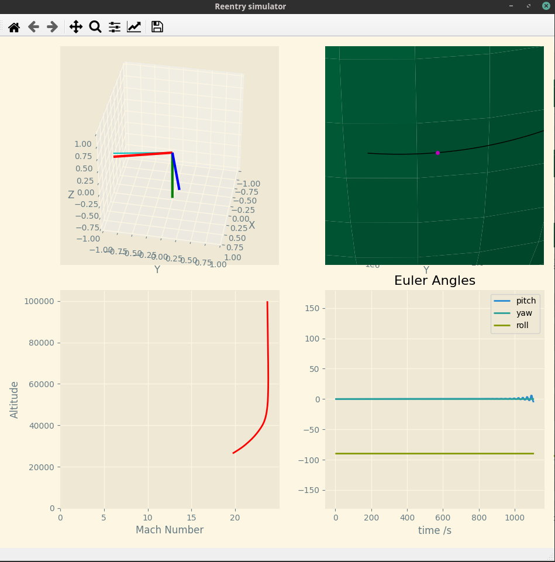

# Welcome to Open Starship!

Welcome to the Open Starship repo - this is a little project I've been working on.

Who wasn't in awe when they saw [2 x 30 ton, 40m tall rockets simultaneously land after sending a Tesla into orbit?](https://youtu.be/wbSwFU6tY1c?t=1738)? In my opinion, SpaceX's landing software is pioneering and beyond what was thought possible before 2012. I'm completing my Engineering degree in quarantine and decided to make a rocket landing framework to test various control systems for landing the some common reusable rockets.

Naturally as an engineer, I've vastly simplified some aspects of aerodynamic effects! I have modelled Falcon 9, Starship and Electron according to several papers and models published by many sources including NASA. I've been consistent with Each company's [coordinate definitions](https://twitter.com/fael097/status/1239777250339364866/photo/1) for each rocket. I would love for this tool to help others learn about control theory and other control algorithms.

Runtimes are vectorised and thus extremely fast. With time steps of 0.01s, the simulation runs at 500x real-speed. I have included a basic plotting script using MatPlotLib to allow for real-time analysis.

## Screenshots

MatPlotLib UI:

## Pipeline

- [ ] Add alternate (faster) plotter
- [ ] Implement various control algorithms (including the [SpaceX paper](https://ieeexplore.ieee.org/document/6428631))
- [ ] Improve models for aerodynamic effects on rigid bodies in transonic regime
- [ ] Implement nonlinearities in engine properties (min thrust, max ignitions)
- [ ] Implement boundary conditions on control problems
- [ ] Document code (collaboration dependent)
- [ ] Add backend to meet requirements of OpenAI gym

## Collaboration

I would love some collaboration on this project - if this project interests you, please make a pull request or get in touch!
